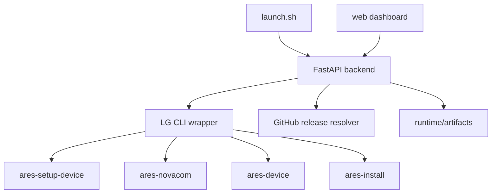

# webOS Sidecar


`📺🚀⚡ Local-first LG webOS sideloading with a neon dashboard, official CLI under the hood, and a simpler install path for Smart TV apps.`

<p>
  
  
  
  
</p>

<p>
  
  
  
  
</p>

`webOS Sidecar` is a local-first LG webOS sideload dashboard by Sharvinzlife. It wraps the official LG CLI, removes the annoying command juggling, and gives you a cleaner install path for apps like Moonfin, Litefin, and other repos that publish LG `.ipk` releases.

## Why this exists

- LG webOS TV sideloading is real, but the official flow is awkward.
- The TV uses `Developer Mode`, `Key Server`, port `9922`, user `prisoner`, and `.ipk` packages.
- A single wrong passphrase, stale SSH key, or Node/runtime mismatch can waste a lot of time.

`webOS Sidecar` keeps the real LG flow, but makes it friendlier:

- browser UI for TV save, key link, package load, install, verify, and launch
- GitHub release resolver for org pages, repos, releases pages, and direct `.ipk` links
- Moonfin-aware source routing
- Litefin-aware source presets with multiple webOS build variants
- automatic uppercase normalization for LG Key Server passphrases
- automatic Node compatibility shim for `@webos-tools/cli` on modern Node versions
- troubleshooting cards tied to real CLI output

## 🚀 One-command start

```bash
./launch.sh
```

Cross-platform launchers are included:

- `🍎 macOS` -> `./launch.sh`
- `🐧 Linux` -> `./launch.sh`
- `🪟 Windows Command Prompt` -> `launch.cmd`
- `💠 Windows PowerShell` -> `.\launch.ps1`
- `🧰 Any platform with Python` -> `python launch.py`

First run will:

1. create `.venv`
2. install Python dependencies
3. install `@webos-tools/cli`
4. apply the local Node compatibility shim automatically
5. wait for the dashboard to answer on `http://127.0.0.1:3847`
6. open the app in your browser automatically

## 🧪 Recommended runtime

- Node: `22.x` via `.nvmrc`
- Python: `3.11+`

The repo now also works on `Node 25` by injecting a compatibility shim for the LG CLI’s bundled `ssh2` dependency.

## 🖥️ Install by platform

### 🍎 macOS

1. install Python `3.11+` and Node `20-25`
2. clone the repo
3. run:

```bash
./launch.sh
```

### 🐧 Linux

1. install Python `3.11+`, `python3-venv`, Node `20-25`, `npm`, and `git`
2. clone the repo
3. run:

```bash
./launch.sh
```

### 🪟 Windows

1. install Python `3.11+` and Node.js `20-25`
2. clone the repo
3. run either:

```powershell
launch.cmd
```

or:

```powershell
.\launch.ps1
```

### ✅ Validation-only mode

If you want a clean dependency check before opening the dashboard:

```bash
python launch.py --check
```

## 🧰 Languages and framework used

- `🐍 Python + FastAPI` for the local API and LG CLI wrapper
- `🧱 HTML + CSS + JavaScript` for the dashboard UI
- `🟩 Node.js + @webos-tools/cli` for the official LG webOS tooling
- `📦 shell + PowerShell + CMD` launchers for multi-platform startup

## 🔌 LG TV setup, simplified

1. On the TV, open `LG Content Store`.
2. Install the `Developer Mode` app.
3. Sign in with your LG developer account.
4. Turn `Dev Mode Status` to `ON`.
5. Let the TV reboot.
6. Open `Developer Mode` again.
7. Turn `Key Server` on.
8. Keep the 6-character code visible.
9. In `webOS Sidecar`, save the TV using:
   - host: your TV IP
   - port: `9922`
   - user: `prisoner`
10. Paste the Key Server code into Step 2.

Important:

- LG Key Server codes are case-sensitive.
- `webOS Sidecar` now normalizes them to uppercase automatically.
- If `Developer Mode` expires, LG removes developer-installed apps from the TV.

## 📦 Supported package sources

- direct `.ipk` URLs
- GitHub repo URLs
- GitHub release URLs
- GitHub org/user URLs
- uploaded `.ipk` files
- uploaded `.zip` bundles that contain a buildable webOS app

### 🎯 Curated app targets

- Moonfin
  - org scan: `https://github.com/Moonfin-Client`
  - release repo: `https://github.com/Moonfin-Client/Smart-TV/releases`
- Litefin
  - repo: `https://github.com/MoazSalem/litefin`
  - releases: `https://github.com/MoazSalem/litefin/releases`
  - known webOS release variants include `es6-webos`, `legacy-webos`, and `ultra-legacy-webos`

## 📏 Package rules

- LG webOS TV developer installs use `.ipk`
- Samsung/Tizen uses `.wgt`
- if a repo only ships `.wgt`, APKs, or source zips, that is not directly installable on LG webOS

## 🗺️ Project structure




## 🧩 Repo layout

```text
app/           FastAPI app, CLI wrapper, resolver, troubleshooting
web/           static dashboard UI
docs/          setup notes, plans, release docs
scripts/       local runtime compatibility helpers
launch.py      shared cross-platform bootstrap
launch.sh      macOS/Linux wrapper
launch.ps1     PowerShell wrapper
launch.cmd     Command Prompt wrapper
runtime/       local artifact cache and recent history
```

## ✅ Local verification notes

Verified in this repo:

- `ares-device --system-info` succeeds against a real LG TV after uppercase passphrase normalization
- Moonfin `.ipk` install succeeds and verifies on TV
- Litefin release detection succeeds through GitHub release resolution
- `POST /api/install` succeeds through the dashboard flow

## 🛠️ Publish checklist

- update `.nvmrc` if the supported Node baseline changes
- keep `CHANGELOG.md` current
- create a GitHub release for each tagged version
- keep the curated app presets aligned with real public `.ipk` releases

## ❤️ Credits

Created with love by Sharvinzlife.

- X: [x.com/sharvinzlife](https://x.com/sharvinzlife)
- Instagram: [instagram.com/sharvininzlife](https://instagram.com/sharvininzlife)
- Facebook: [fb.com/sharvinzlife](https://fb.com/sharvinzlife)
- GitHub: [github.com/sharvinzlife](https://github.com/sharvinzlife)

## 🔗 References

- [LG Developer Mode app guide](https://webostv.developer.lge.com/develop/getting-started/developer-mode-app)
- [LG webOS CLI introduction](https://webostv.developer.lge.com/develop/tools/cli-introduction)
- [webos-tools/cli](https://github.com/webos-tools/cli)
- [Moonfin Smart-TV](https://github.com/Moonfin-Client/Smart-TV)
- [Litefin](https://github.com/MoazSalem/litefin)
